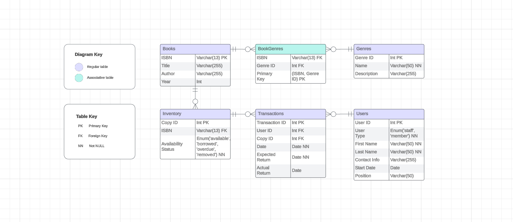

# Library Management System Database Solution

## Overview

This document outlines the database solution for a Library Management System, including the necessary tables and their relationships. The system is designed to manage books, users (staff and library members), transactions, inventory, genres, and track overdue transactions.

> **Reminder:**
> The provided solution is a recommended approach, there may be alternative solutions based on your specific preferences and requirements. Feel free to expand and adapt the solution to best suit your interests.

## Entity-Relationship Diagram

## Tables

### 1. Books

- Represents information about each book in the library.
- Attributes:
  - ISBN (Primary Key)
  - Title
  - Author
  - Publication Year

### 2. Genres

- Contains information about book genres.
- Attributes:
  - Genre ID (Primary Key)
  - Name
  - Description

### 3. Users

- Stores details about users, including staff members and library members.
- Attributes:
  - User ID (Primary Key)
  - User Type (staff or library_member)
  - First name
  - Last name
  - Contact Information
  - Membership Start Date (For library members)
  - Position (For staff members)

### 4. Transactions

- Records book borrowing and returning transactions.
- Attributes:
  - Transaction ID (Primary Key)
  - User ID (Foreign Key to Users)
  - Copy ID (Foreign Key to Inventory)
  - Transaction Type (borrow or return)
  - Transaction Date
  - Expected Return Date

### 5. Inventory

- Manages the copies of each book available in the library.
- Attributes:
  - Copy ID (Primary Key)
  - ISBN (Foreign Key to Books)
  - Availability Status

### 6. BookGenres (Associative Table)

- Facilitates a many-to-many relationship between Books and Genres.
- Attributes:
  - ISBN (Foreign Key to Books)
  - Genre ID (Foreign Key to Genres)

## Queries & Views

### 1. Returns

- A view to track both overdue and expected return transactions.
- Includes transactions where books have been borrowed and yet to be returned.

## Notes

- The database schema uses standard relational database concepts, including primary and foreign keys, to establish relationships between entities.
- Consideration is given to user types (staff or library members) with specific attributes for each type.
- An associative table (BookGenres) is introduced to handle the many-to-many relationship between books and genres.
