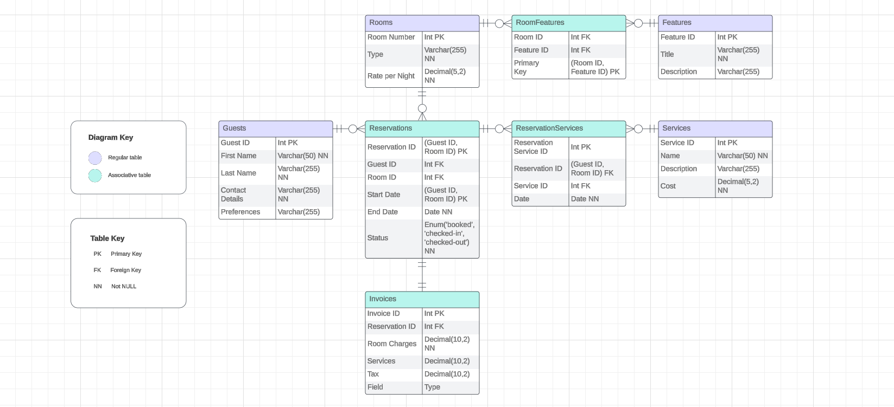

# Hotel Reservation System Database Solution

## Overview

This document outlines the database solution for a Hotel Reservation System, including the necessary tables and their relationships. The system is designed to efficiently manage guests, rooms, reservations, invoices, and additional services.

> **Reminder:**
> The provided solution is a recommended approach, there may be alternative solutions based on your specific preferences and requirements. Feel free to expand and adapt the solution to best suit your interests.

## Entity-Relationship Diagram



## Tables

### 1. Guests

- Contains information on each hotel guest.
- Attributes:
  - Guest ID (Primary Key)
  - First Name
  - Last Name
  - Contact Details
  - Preferences

### 2. Rooms

- Contains information about each room in the hotel.
- Attributes:
  - Room Number (Primary Key)
  - Room Type
  - Nightly Rate

### 3. Features

- Stores details about all available room features that are offered.
- Attributes:
  - Feature ID (Primary Key)
  - Title
  - Description

### 4. Services

- Contains information on all additional services the hotel offers.
- Attributes:
  - Service ID (Primary Key)
  - Name
  - Description
  - Cost

### 5. Reservations (Associative Table)

- Contains information on all reservations that are made.
- Attributes:
  - Reservation ID (Primary Key)
  - Guest ID (Foreign Key to Guests)
  - Room ID (Foreign Key to Rooms)
  - Start Date
  - End Date
  - Check-in Status
  - Total Cost

### 6. RoomFeatures (Associative Table)

- Facilitates a many-to-many relationship between Rooms and their corresponding features.
- Attributes:
  - RoomFeatures ID (Primary Key)
  - Room ID (Foreign Key to Rooms)
  - Feature ID (Foreign Key to Features)

### 7. ReservationServices (Associative Table)

- Facilitates a many-to-many relationship between Reservations and Services.
- Attributes:
  - ReservationService ID (Primary Key)
  - Reservation ID (Foreign Key to Reservations)
  - Service ID (Foreign Key to Services)
  - Purchase Date

### 8. Invoices (Associative Table)

- Generates invoices for guests based on reservations and additional services.
- Attributes:
  - Invoice ID (Primary Key)
  - Guest ID (Foreign Key to Guests)
  - Issue Date
  - Paid Status

### 9. InvoiceReservationLink (Associative Table)

- Facilitates a many-to-many relationship between Invoices and Reservations.
- Attributes:
  - Link ID (Primary Key)
  - Invoice ID (Foreign Key to Invoices)
  - Reservation ID (Foreign Key to Reservations)

### 10. InvoiceServiceLink (Associative Table)

- Facilitates a many-to-many relationship between Invoices and Reservations.
- Attributes:
  - Link ID (Primary Key)
  - Invoice ID (Foreign Key to Invoices)
  - Service ID (Foreign Key to Services)

## Queries &  Views

### 1. Check Total Cost

- A view to check the total cost of unpaid reservations and services ordered by a singular guest.
- Includes information on reservations and purchased services.

*To be completed...*

### 2. Check Available Rooms

- A view to track current available rooms.
- Includes room numbers, room types and nightly rates.

```sql
CREATE VIEW AvailableRooms AS
SELECT
    Rooms.RoomNumber,
    Rooms.RoomType,
    Rooms.NightlyRate
FROM Rooms
WHERE Rooms.RoomNumber NOT IN (
    SELECT Reservations.RoomID
    FROM Reservations
    WHERE CURRENT_DATE BETWEEN Reservations.CheckInDate AND Reservations.CheckOutDate
);
```

### 3. Check Room Occupancy

- A view to track the current occupancy status of a specific room.
- Includes room number, guest details and reservation dates.

```sql
CREATE VIEW CheckRoom AS
SELECT
    R.RoomNumber,
    G.GuestID,
    G.FirstName,
    G.LastName,
    R.CheckInDate,
    R.CheckOutDate
FROM Reservations R
JOIN Guests G ON R.GuestID = G.GuestID
WHERE R.RoomNumber = [InputRoomNumber]
```

## Notes

- The database schema uses standard relational database concepts, including primary and foreign keys, to establish relationships between entities.
- To include purchased services on the invoice, use the ServiceCheck view and run a query gathering relevant details from the ReservationServices table, considering reservation and guest IDs. This involves combining data, grouping, and calculating totals for a complete invoice summary.

> **Notice:**
>  Please note that this solution is a work in progress and may undergo further refinement based on specific requirements. Feel free to contribute or provide feedback where necessary.
