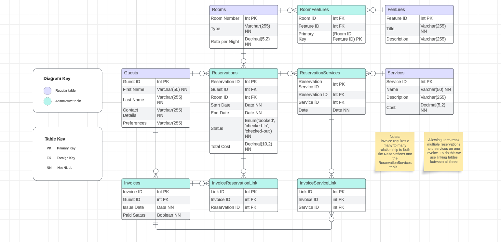

# Hotel Reservation System Database Solution

## Overview

This document outlines the database solution for a Hotel Reservation System, including the necessary tables and their relationships. The system is designed to efficiently manage guests, rooms, reservations, invoices, and additional services.

> **Reminder:**
> The provided solution is a recommended approach, there may be alternative solutions based on your specific preferences and requirements. Feel free to expand and adapt the solution to best suit your interests.

## Entity-Relationship Diagram

## Tables

### 1. Rooms

- Contains information about each room in the hotel.
- Attributes:
  - Room Number (Primary Key)
  - Type
  - Rate per Night

### 2. Guests

- Stores details about hotel guests.
- Attributes:
  - Guest ID (Primary Key)
  - First Name
  - Last Name
  - Contact Details
  - Preferences

### 3. Features

- Stores details about all available room features that are offered.
- Attributes:
  - Feature ID (Primary Key)
  - Title
  - Description

### 4. Services

- Contains information on all additional services the hotel offers.
- Attributes:
  - Service ID (Primary Key)
  - Name
  - Description
  - Cost

### 5. Services

- Contains information on all additional services the hotel offers.
- Attributes:
  - Service ID (Primary Key)
  - Name
  - Description
  - Cost

### 6. RoomFeatures (Associative Table)

- Facilitates a many-to-many relationship between Rooms and their corresponding features.
- Attributes:
  - RoomFeatures ID (Primary Key)
  - Room ID (Foreign Key to Rooms)
  - Feature ID (Foreign Key to Features)

### 7. ReservationServices (Associative Table)

- Facilitates a many-to-many relationship between Reservations and Services.
- Attributes:
  - ReservationService ID (Primary Key)
  - Reservation ID (Foreign Key to Reservations)
  - Service ID (Foreign Key to Services)
  - Date

### 8. Invoices (Associative Table)

- Generates invoices for guests based on reservations and additional services.
- Attributes:
  - Invoice ID (Primary Key)
  - Reservation ID (Foreign Key to Reservations)
  - Guest ID (Foreign Key to Guests)
  - Service ID (Foreign Key to ReservationServices **optional**)
  - Room Charges
  - Services
  - Tax

## Views

### 1. RoomOccupancy

- A view to track the current occupancy status of each room.
- Includes room number, guest details, and reservation dates.

### 2. ServiceCheck

- A view to check the additional services ordered by guests.
- Includes guest details, reservation information, and the services selected.

## Notes

- The database schema uses standard relational database concepts, including primary and foreign keys, to establish relationships between entities.
- To include purchased services on the invoice, use the ServiceCheck view and run a query gathering relevant details from the ReservationServices table, considering reservation and guest IDs. This involves combining data, grouping, and calculating totals for a complete invoice summary.

> **Notice:**
>  Please note that this solution is a work in progress and may undergo further refinement based on specific requirements. Feel free to contribute or provide feedback where necessary.
