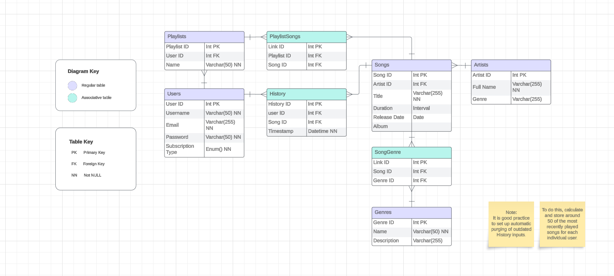

# Music Streaming System Database Solution

## Overview

This document outlines the database solution for a Music Streaming System, including the necessary tables and their relationships. The system is designed to efficiently manage users, artists, songs, playlists, genres, and user listening history.

> **Reminder:**
> The provided solution is a recommended approach, and there may be alternative solutions based on your specific preferences and requirements. Feel free to expand and adapt the solution to best suit your interests.

## Entity-Relationship Diagram

## Tables

### 1. Users

- Contains information on each user of the music streaming platform.
- Attributes:
  - User ID (Primary Key)
  - Username
  - Email
  - Password
  - Created At (Timestamp)

### 2. Artists

- Contains information about each music artist or band.
- Attributes:
  - Artist ID (Primary Key)
  - Artist Name
  - Genre

### 3. Songs

- Stores details about each song available on the platform.
- Attributes:
  - Song ID (Primary Key)
  - Song Title
  - Artist ID (Foreign Key to Artists)
  - Genre
  - Release Date
  - Song Duration (in seconds)
  - File Path or URL

### 4. Genres

- Stores information about different music genres.
- Attributes:
  - Genre ID (Primary Key)
  - Genre Name

### 5. Playlists

- Contains information on user-created playlists.
- Attributes:
  - Playlist ID (Primary Key)
  - Playlist Name
  - User ID (Foreign Key to Users)
  - Created At (Timestamp)

### 6. History

- Stores information about the songs recently played by each user.
- Attributes:
  - History ID (Primary Key)
  - User ID (Foreign Key to Users)
  - Song ID (Foreign Key to Songs)
  - Playback Date (Timestamp)