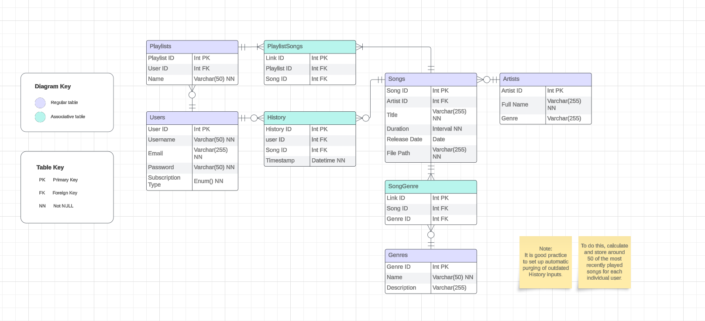

# Music Streaming System Database Solution

## Overview

This document outlines the database solution for a Music Streaming System, including the necessary tables and their relationships. The system is designed to efficiently manage users, artists, songs, playlists, genres, and user listening history.

> **Reminder:**
> The provided solution is a recommended approach, and there may be alternative solutions based on your specific preferences and requirements. Feel free to expand and adapt the solution to best suit your interests.

## Entity-Relationship Diagram

## Tables

### 1. Users

- Contains information on each user of the music streaming platform.
- Attributes:
  - User ID (Primary Key)
  - Username
  - Email
  - Password
  - Subscription Type

### 2. Artists

- Contains information about each music artist or band.
- Attributes:
  - Artist ID (Primary Key)
  - Artist's Full Name
  - Genre

### 3. Songs

- Stores details about each song available on the platform.
- Attributes:
  - Song ID (Primary Key)
  - Artist ID (Foreign Key to Artists)
  - Title
  - Duration
  - Release Date
  - File Path

### 4. SongGenres (Associative Table)

- Contains information on the genres each song belongs to.
- Attributes:
  - Link ID (Primary Key)
  - Song ID (Foreign Key to Songs)
  - Genre ID (Foreign Key to Genres)

### 5. Genres

- Stores information about different music genres.
- Attributes:
  - Genre ID (Primary Key)
  - Name
  - Description

### 6. Playlists

- Contains information on user-created playlists.
- Attributes:
  - Playlist ID (Primary Key)
  - User ID (Foreign Key to Users)
  - Playlist Name

### 7. PlaylistSongs (Associative Table)

- Contains information on which songs are in which playlists.
- Attributes:
  - Link ID (Primary Key)
  - Playlist ID (Foreign Key to Playlists)
  - Song ID (Foreign Key to Songs)

### 8. History

- Stores information about the songs recently played by each user.
- Attributes:
  - History ID (Primary Key)
  - User ID (Foreign Key to Users)
  - Song ID (Foreign Key to Songs)
  - Playback Date

## Queries & Views

> **Note:**
> This section is currently under development.

## Notes

- The database schema uses standard relational database concepts, including primary and foreign keys, to establish relationships between entities.
- Consideration is given for user subscription types with an unspecified ENUM for each.
- It is advisable to implement data pruning in the History table to enhance database efficiency and ensure the maintenance of pertinent user activity records.

> **Notice:**
>  Please note that this solution is a work in progress and may undergo further refinement based on specific requirements. Feel free to contribute or provide feedback where necessary.
