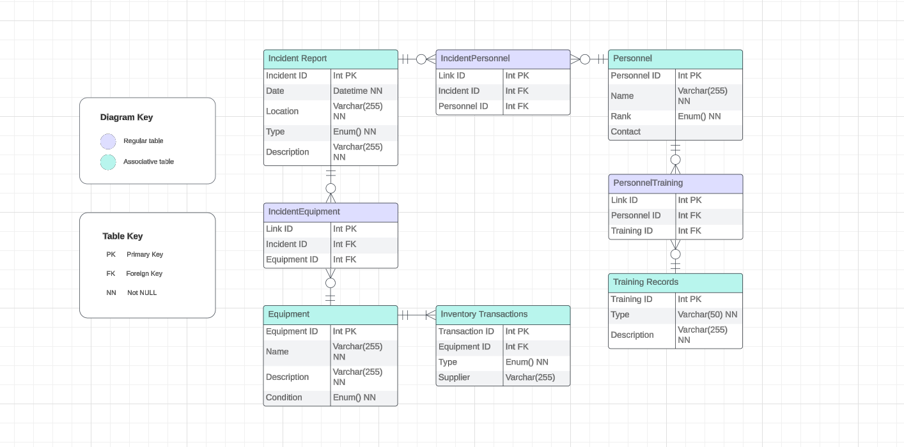

# Military Bomb Squad Inventory Solution

## Overview

This document outlines the database solution for a Military Bomb Squad's Inventory Management System, including the necessary tables and their relationships. The system is designed to efficiently manage personnel, incident reports, equipment, training records, genres and general inventory transactions.

> **Reminder:**
> The provided solution is a recommended approach, and there may be alternative solutions based on your specific preferences and requirements. Feel free to expand and adapt the solution to best suit your interests.

## Entity-Relationship Diagram

## Tables

### 1. Personnel

- Contains information on each registered personnel.
- Attributes:
  - Personnel ID (Primary Key)
  - Name
  - Rank
  - Contact

### 2. Training Records

- Contains information about each type of training, including what it is & how its done.
- Attributes:
  - Training ID (Primary Key)
  - Type
  - Description

### 3. Personnel Training (Associative Table)

- Stores details on which personnel members have done which training exercises, for measuring qualifications.
- Attributes:
  - Link ID (Primary Key)
  - Personnel ID (Foreign Key to Personnel)
  - Training ID (Foreign Key to Training Records)

### 4. Incident Report

- Contains information on every recorded incident.
- Attributes:
  - Incident ID (Primary Key)
  - Date
  - Location
  - Type
  - Description

### 5. Incident Personnel (Associative Table)

- Stores information on which personnel are involved in which incidents.
- Attributes:
  - Link ID (Primary Key)
  - Incident ID (Foreign Key to Incident Report)
  - Personnel ID (Foreign Key to Personnel)

### 6. Equipment

- Contains information on all the stored & recorded equipment, including condition & description.
- Attributes:
  - Equipment ID (Primary Key)
  - Name
  - Description
  - Condition

### 7. Incident Equipment (Associative Table)

- Contains information about which pieces of equipment are involved in which incident.
- Attributes:
  - Link ID (Primary Key)
  - Incident ID (Foreign Key to Incident Report)
  - Equipment ID (Foreign Key to Equipment)

### 8. Inventory Transactions

- Stores information on the purchases & retirement of equipment
- Attributes:
  - Transaction ID (Primary Key)
  - Equipment ID (Foreign Key to Equipment)
  - Type
  - Supplier

## Queries & Views

> **Note:**
> This section is currently under development.

## Notes

- The database schema uses standard relational database concepts, including primary and foreign keys, to establish relationships between entities.
- Consideration is given for user subscription types with an unspecified ENUM for each.
- It is advisable to implement data pruning in the History table to enhance database efficiency and ensure the maintenance of pertinent user activity records.

> **Notice:**
>  Please note that this solution is a work in progress and may undergo further refinement based on specific requirements. Feel free to contribute or provide feedback where necessary.
